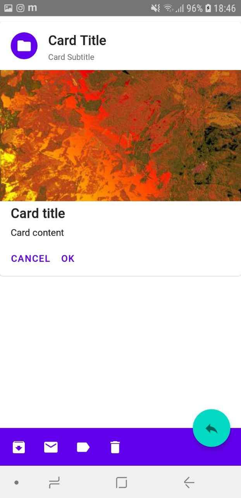

# React Native Paper ✨<br>Boilerplate

## Usage:
Set up react-native-cli and prepare a mobile device:<br>
https://facebook.github.io/react-native/docs/getting-started


```
npm install
react-native [run-android/run-ios]

```

## Start Development

```
cd src
[start editing]

```

[React Native Paper documentation](https://callstack.github.io/react-native-paper/)<br>
[React Native documentation](https://facebook.github.io/react-native/docs/tutorial)

## Screenshots
