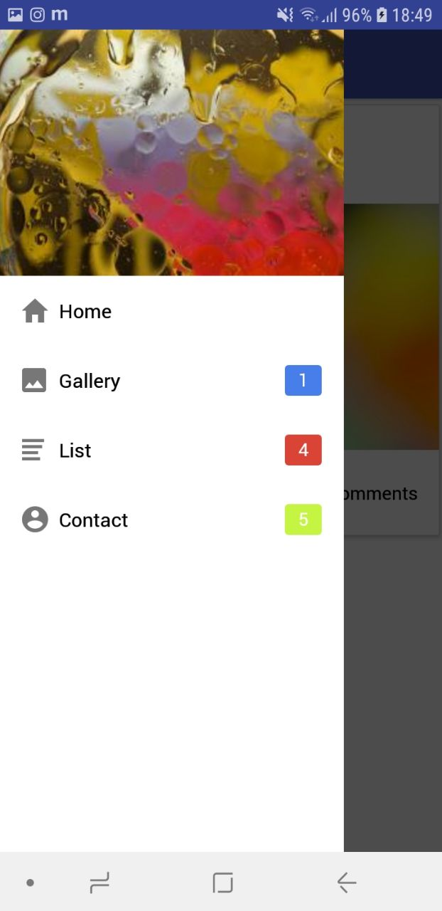

# Native Base ✨<br>React Navigation (Drawer Navigator) 🎌<br>Boilerplate

## Usage:
Set up react-native-cli and prepare a mobile device:<br>
https://facebook.github.io/react-native/docs/getting-started


```
npm install
react-native [run-android/run-ios]

```

## Start Development

```
cd src
[start editing]

```

[React Navigation documentation](https://reactnavigation.org/docs/en/tab-based-navigation.html)<br>
[Native Base documentation](https://docs.nativebase.io/)<br>
[React Native documentation](https://facebook.github.io/react-native/docs/tutorial)<br>

## Screenshots
