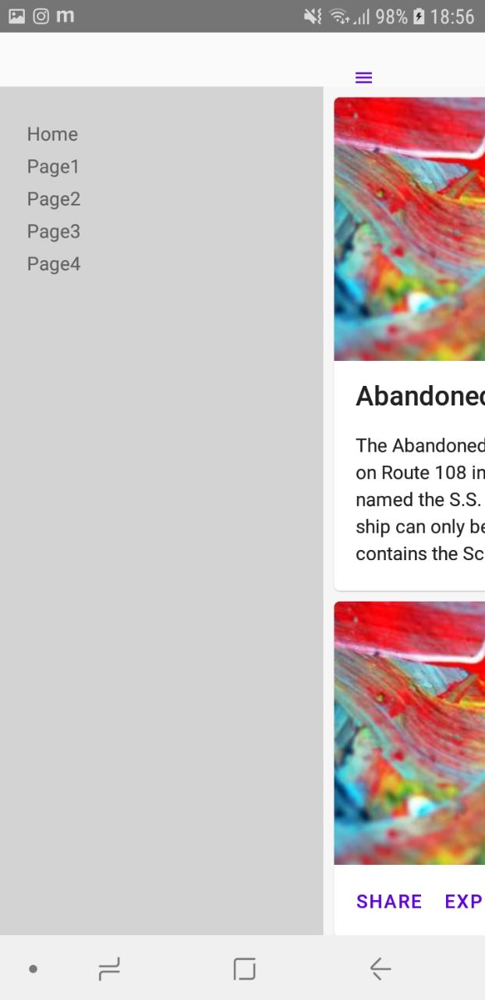

# React Native Elements ✨<br>React Native Side Menu + React Router Native 🎌<br>Boilerplate

## Usage:
Set up react-native-cli and prepare a mobile device:<br>
https://facebook.github.io/react-native/docs/getting-started


```
npm install
react-native [run-android/run-ios]

```

## Start Development

```
cd src
[start editing]

```

[React Router Native tutorial](https://reacttraining.com/react-router/native/guides/quick-start)<br>
[React Native Elements documentation](https://react-native-training.github.io/react-native-elements/)<br>
[React Native Side Menu github](https://github.com/react-native-community/react-native-side-menu)<br>
[React Native documentation](https://facebook.github.io/react-native/docs/tutorial)<br>

## Screenshots
